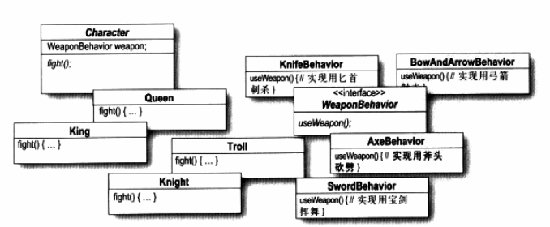

# 简介

在企业开发中，常常会有一些对象需要使用多种算法实现一些业务逻辑。例如支持多种排序算法的排序工具类，支持多种加密方式的加密类。

一种不好的解决办法就是通过大量的分支语句进行判断，如下。

```java
public class Encryptor {
    private String algorithmName;
    private String plainText;
    public Encryptor(String algorithmName){
       this.algorithmName=algorithmName;
   }
    public void encrypt(){
        if (algorithmName.equals("Aes")){
            System.out.println("Encrypting data using AES algorithm");
            // 想象这里有大量的代码
        }
       else if (algorithmName.equals("Blowfish")){
            System.out.println("Encrypting data using Blowfish algorithm");
            // 想象这里有大量的代码
        }
        // 想象这里还有大量的分支
    }
   /*Getter and setter methods for plainText*/  
}
```

很明显，这种做法导致可读性差，而且难以修改。这时候可以采用策略模式，编写一个策略接口，该接口有多种实现，利用多态的特性，客户端只需要持有策略接口，然后根据传递进来的策略实现，执行相应的操作。

现在我们编写一个加密工具类，它支持多种加密算法，具体内容看项目中的代码即可。

**再来看一个例子**

现在要实现游戏里面的一个功能，游戏里面有多种职业，不同职业使用的战斗方式可能相同，也可能不同，这个时候要怎么设计？



**总结**

实现同样一件事情，具有多种方法，具体采用哪种方法，需要根据实际情况来选择，这时候可以使用策略模式。